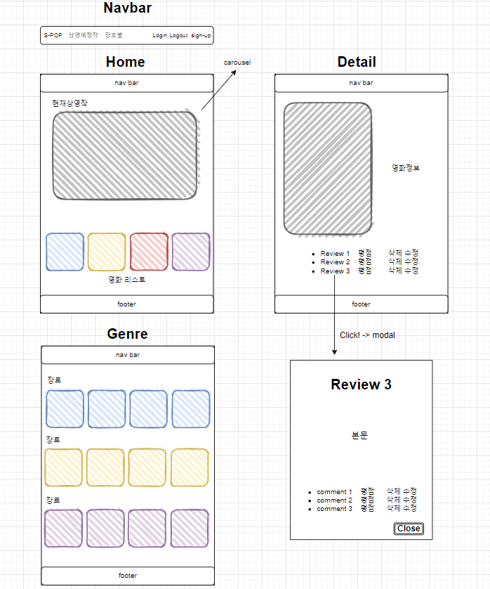
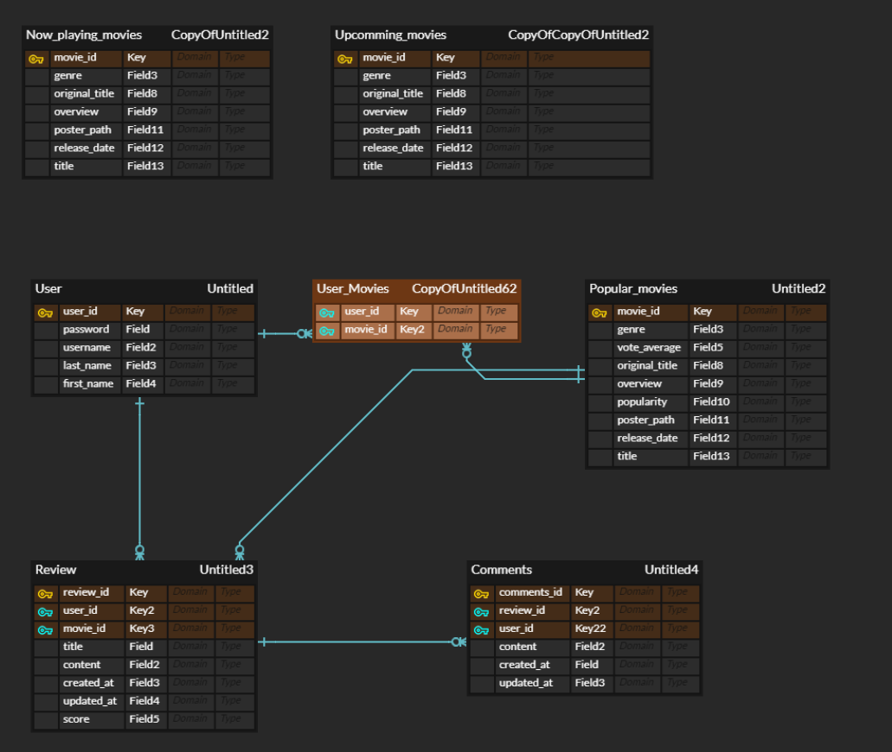

# Final-pjt

## 개발 환경
- 개발 언어
  - Django
  - Vue

- 목표
  - 영화 데이터 기반 추천 서비스 구성
  - 영화 추천 알고리즘 구성
  - 커뮤니티 서비스 구성
  - HTML, CSS, JavaScript, Vue.js, Django, REST API, Database 등을 활용한
    실제 서비스 설계
  - 서비스 관리 및 유지보수
  
## Team info

1. 팀원 정보

	- 김광용
	
	> 
	
	- 이건후
	
	> 

## Final-pjt-front

- **Structure**

|    컴포넌트     |        요구기능         | 구현 여부 |
| :-------------: | :---------------------: | :-------: |
|    MovieList    |     영화 목록 조회      |     x     |
|                 |       유형별 정렬       |     x     |
|   MovieDetail   |   세부 영화 정보 조회   |     x     |
|                 |     영화 리뷰 표시      |     x     |
| Movie Recommend | 알고리즘 기반 영화 추천 |     x     |
|   ReviewForm    |        리뷰 작성        |     x     |
|   ReviewList    |     리뷰 목록 조회      |     x     |
|  ReviewDetail   |   리뷰 상세 내용 표시   |     x     |
|   CommentForm   |        댓글 작성        |     x     |
|   CommentList   |     댓글 목록 조회      |     x     |
| CommentListItem | 본인 댓글 수정 및 삭제  |     x     |
|      Login      |         로그인          |     x     |
|     Logout      |        로그아웃         |     x     |
|     Signup      |        회원가입         |     x     |
|     Profile     |    사용자 정보 조회     |     x     |

- **Design**

## Final-pjt-back

- **Structure**

|    앱    |   페이지    | API 요청                                                     |
| :------: | :---------: | :----------------------------------------------------------- |
|  movies  | 영화 리스트 | 영화 리스트  조회(GET)                                       |
|          | 영화 디테일 | 영화 세부정보  조회(GET) 영화 리뷰 전체 조회(GET) 영화 좋아요(POST) 영화 리뷰 작성(POST) |
|          | 리뷰(모달)  | 리뷰  세부정보 조회(GET)      영화 리뷰 수정(PUT)      리뷰 좋아요(POST)      영화 리뷰 삭제(DELETE)      댓글 전체 조회(GET)      댓글 작성(POST)      댓글 수정(PUT)      댓글 삭제(DELETE) |
|          | 추천 페이지 | 알고리즘 기반  영화 추천(GET)                                |
| accounts |   프로필    | 프로필 유저가  좋아요한 영화(GET)      프로필 유저가 생성한 리뷰(GET)      프로필 유저가 생성한 댓글(GET) |

- **ERD**

